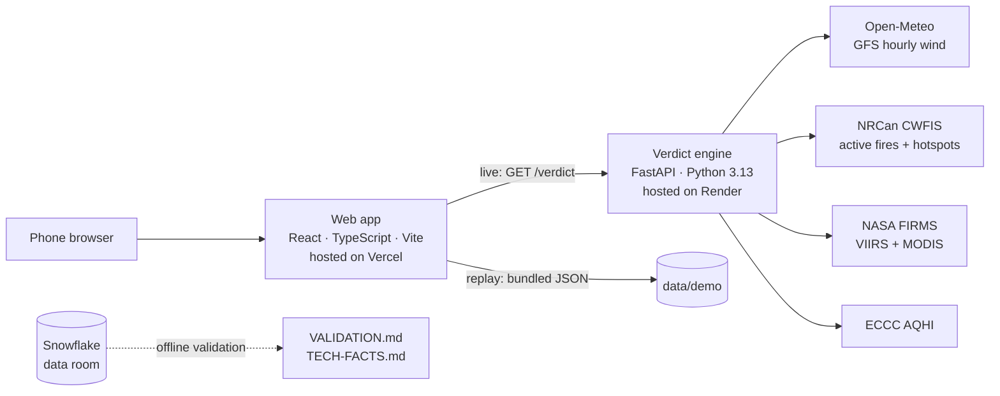

# Smoke or Fire? / Fumée ou feu ?

**Smell wildfire smoke? Find out in 60 seconds whether it's drifting from a known fire or something new, traced with real wind and satellite data.**
Bilingual (English/French), built for seniors, nothing to install.

**Live app:** https://smoke-or-fire.vercel.app · **Replay of the Aug 25, 2025 event:** https://smoke-or-fire.vercel.app/?mode=replay

Built at **Hack Atlantic 2026** (UNB Fredericton, Sept 26–27).

> ⚠️ Smoke or Fire? is not an emergency service. If you see flames or a smoke column, call **911**.

---

## The problem

When people smell smoke, they can't tell whether it's a fire near them or smoke drifting from a fire more than 100 km away. So they either call 911 to find out, or risk ignoring a real fire.

- In **August 2025**, smoke from wildfires in Nova Scotia and New Brunswick drifted over **Fredericton** and led to widespread 911 calls.
- On the morning of **August 25, 2025**, fire departments in **Moncton, Dieppe and Riverview received about 300 calls**, and dispatchers had to screen each one. The smoke came from the **Long Lake fire in Nova Scotia, about 159 km away.**
- Firefighters **need** people to report new fires, but not hundreds of calls about a fire they're already fighting. Today the only advice is to judge the smoke by eye.

The information exists (active fires, satellite detections, wind, air quality), but it's spread across different sites. Nothing combines it to answer one question: **is the smoke I smell from a known fire?**

## The solution

One question, your location, and a plain-language answer:

| Verdict | Meaning |
|---|---|
| **Drifting smoke** | The air reaching you passed within 25 km of a known fire |
| **Unclear** | It passed 25–50 km from a fire, or the wind was unsteady |
| **Unexplained smoke** | No known fire near the air's path; look outside, it may be local |

Every answer comes with an honest **High / Medium / Low confidence**, official air-quality advice, and **911 one tap away on every screen**. The app never tells anyone not to call 911.

**Scenario 1: smoke from far away (Moncton, Aug 25, 2025).** *Drifting smoke, likely from the Long Lake fire, 159 km away, low confidence.* The map shows the air traced backward and the fire's smoke traced forward meeting near Moncton. Then: official AQHI advice, Health Canada's advice to take a break in places with filtered air (one tap finds the nearest library), and the 811 nurse line.

**Scenario 2: fire near you (Bridgetown, N.S.).** Flames or a smoke column → **Call 911 now**, with what to tell the dispatcher. *Told to leave?* → the reception centre **Annapolis County actually opened** during the Long Lake evacuation, register first, directions in the phone's Maps app, the officials' grab list, and a one-tap text to family with the user's location. It's shown only to people near that fire.

**Built for seniors:** large text and targets (tested down to iPhone SE), a guided **Listen** voice on every screen (EN/FR), colour + icon + word for every status, and nothing to install (open a link, or add it to the home screen).

---

## Architecture



| Part | Role | Hosting |
|---|---|---|
| **engine/** | Traces the air, fuses fire data, returns the verdict as JSON | **Render** (free web service, `render.yaml` blueprint). Wind and FIRMS refresh in background threads and are cached to disk, so a restart answers within seconds. A scheduled ping to `/health` keeps it awake. |
| **web/** | All screens, EN/FR strings, maps drawn with d3-geo | **Vercel** (static build). The replay is bundled, so it never depends on the engine. |
| **analytics/** | Season-scale validation in SQL + Streamlit | **Snowflake** (offline; the app never calls it at runtime) |

### API
| Endpoint | Description |
|---|---|
| `GET /verdict?lat=&lon=&time=&mode=live\|replay` | Verdict, confidence, traced paths (3 heights), closest approach, forward check, featured fire, AQHI, source status |
| `GET /health` | Whether live wind and FIRMS data are loaded |
| `GET /` | Service description |

---

## Method

1. **Backward trajectories:** from the user's location, the air is traced back up to **24 h in 1-hour Heun steps** through a **0.5° wind grid (693 points, 41–51°N, 72–56°W)** at **three heights: 100 m, 925 hPa and 850 hPa**. This is the same trajectory method as NOAA's HYSPLIT.
2. **Fires:** NASA FIRMS detections + NRCan CWFIS fires and hotspots within **500 km**, from the last **24 h**, clustered at **5 km**. Under-control fires are excluded.
3. **Fusion:** a CWFIS hotspot republished from FIRMS (within 50 m, same fire power) is merged into its original, and **keeps the satellite's observation time, not the report time.** Same-satellite duplicates (within 1 km and 30 min) are merged too.
4. **Closest approach:** the shortest distance between the traced path and each fire. A fire counts only if the air actually passed it (not just near the starting point).
5. **Verdict and confidence** follow a fixed table ([design/DESIGN-LOCK.md](design/DESIGN-LOCK.md)):

| Closest approach | Wind steady | Wind unsteady (direction spread > 45°) |
|---|---|---|
| ≤ 25 km | Drifting: High if ≤ 10 km, else Medium | Unclear, Low |
| 25–50 km | Unclear, Medium | Unclear, Low |
| > 50 km or no fire | Unexplained, Medium | Unexplained, Low |

   If the three heights don't give the same verdict, **confidence drops one level.**

6. **Forward check:** smoke released from the featured fire every hour, at all three heights, is traced forward. It's shown as corroborating evidence and **never changes the verdict.**

**Moncton, Aug 25, 2025 12:00 UTC:** drifting smoke from Long Lake, **low** confidence (closest approach 19 / 32 / 46 km by height). The forward smoke passed **2 km** from Moncton. Six satellites (Aqua, NOAA-20, NOAA-21, Sentinel-3A, Suomi NPP, Terra) saw the fire in the previous 24 h.

---

## Validation

The **unchanged** engine was tested on real 2025 events where smoke was publicly reported, plus two quiet control days. **The rules were committed before any run.** Full table and sources: [VALIDATION.md](VALIDATION.md).

- Long Lake smoke correctly traced for **Moncton (Aug 25)** and **Charlottetown (Aug 14)**.
- Two events matched the rules but for the **wrong source**: a Saint John refinery that satellites see as heat. This is documented, with the fix planned.
- One miss (**Halifax, Aug 26**): the fire hadn't been seen by satellites in over 24 h. The app then says *"look outside, call 911 if you see flames."* It fails toward caution.
- Both control days: correctly *unexplained*.

## Snowflake data room

The whole **2025 Maritimes fire season (4,563 NASA FIRMS detections)** plus the replay data, loaded into Snowflake:
- **Independent cross-check:** SQL recomputes the engine's de-duplication: **148 merges (128 republished twins + 20 same-satellite), the same pairs as the Python engine.**
- **Persistent heat (H3, resolution 7):** ranks the places seen "burning" on the most days. The Saint John refinery appears on **71 days between June and September**, mostly labelled by NASA as a static land source.
- **Long Lake timeline:** 93 satellite passes and 1,718 detections, Aug 14 – Sep 20, 2025.
- A **Streamlit app inside Snowflake** presents all three. Code: [analytics/](analytics/).

---

## Repository structure

```
smoke-or-fire/
├── engine/            Python verdict engine (FastAPI)
│   ├── smoke_engine/  trajectory, fires, verdict, AQHI, places, live/replay feeds
│   ├── scripts/       replay fetch, demo build, place data, TECH-FACTS generator
│   └── tests/
├── web/               React + TypeScript app (Vite)
│   ├── src/           screens, EN/FR strings, curated data
│   ├── public/        web app manifest and icons
│   └── scripts/       data build, icons, missing-translation report
├── data/              replay recordings, demo verdicts, validation data, places
├── analytics/         Snowflake SQL views and Streamlit data room
├── design/            frozen screens, DESIGN-LOCK.md, GAPS.md
├── render.yaml        Render blueprint for the engine
├── TECH-FACTS.md      numbers generated from the code, data and test runs
├── VALIDATION.md      tests on real 2025 events
└── HURDLES.md         problems hit and how they were solved
```

## Running locally

**Engine** (Python 3.13, [uv](https://docs.astral.sh/uv/)):
```bash
cd engine
uv sync
uv run uvicorn smoke_engine.main:app --port 8000
uv run pytest
```
Optional: `FIRMS_MAP_KEY=...` in `engine/.env` enables NASA FIRMS in live mode (free key from NASA FIRMS). Without it, the engine runs with CWFIS only.

**Web:**
```bash
cd web
npm install
npm run dev        # set VITE_ENGINE_URL to your engine for live mode
npm test           # unit tests
npm run e2e        # browser tests
```
See `web/package.json` for all scripts. Current test counts are in [TECH-FACTS.md](TECH-FACTS.md).

---

## Design principles

- **Never** the word "safe", and nothing that discourages calling 911.
- 911 is visible on every screen after the first.
- No green anywhere: smoke is never "all clear". Every status uses colour + icon + word.
- Body text 18 px or more, touch targets 56 px or more, fully bilingual.
- Every number on screen comes from the engine. Every place and phone number comes from an official, cited source.

## Known limitations

- Satellites see **industrial heat** (e.g. refineries) as hotspots. Filtering by NASA's labels is the next fix.
- A new fire can take **hours** to appear in satellite data, and a fire hidden by cloud or smoke for over 24 h drops out.
- The AQHI is an **area-wide** reading; smoke from a nearby source can be much stronger.
- Traces can leave the wind grid before 24 h; the app says how many hours it traced.
- Evacuation centres are shown only for events officials announced; the app plans no routes (it hands the address to the phone's maps app).

## Roadmap

- Filter static heat sources using NASA's type labels.
- Pilot with a municipality or EMO, with official live evacuation announcements.
- An embeddable version for city and fire-department websites.
- Natural recorded voices, and voice questions once they understand every accent.

## Data sources and credits

| Data | Source | Licence |
|---|---|---|
| Active fires and satellite hotspots | Natural Resources Canada, CWFIS | Open Government Licence – Canada |
| Satellite fire detections (VIIRS, MODIS) | NASA FIRMS | We acknowledge the use of data from NASA's FIRMS, part of NASA's ESDIS |
| Air Quality Health Index | Environment and Climate Change Canada | Open Government Licence – Canada |
| Wildfire smoke advice | Health Canada, "Wildfire smoke with extreme heat" | — |
| Hourly wind (GFS 0.25°) | Open-Meteo.com | CC BY 4.0 |
| Community names and locations | NRCan, Canadian Geographical Names Database | Open Government Licence – Canada |
| Province and marine outlines | Natural Earth | Public domain |
| Long Lake evacuation centres and alerts | Municipality of the County of Annapolis (REMO), Aug–Sep 2025 releases | — |
| Centre coordinates | NRCan Geolocation Service | Open Government Licence – Canada |

---

**Author:** Soufiane Amribt, Computer Science, University of New Brunswick
