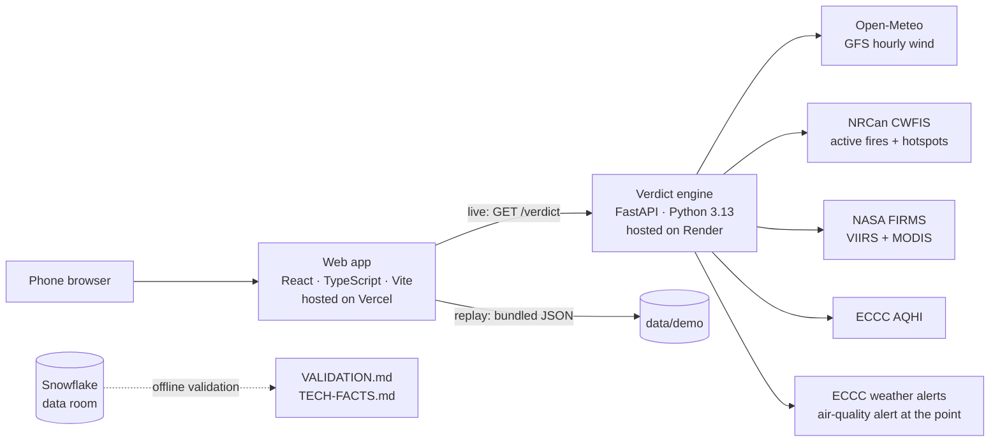

# Smoke or Fire? / Fumée ou feu ?

**Smell wildfire smoke? Find out in 60 seconds whether it's drifting from a known fire or something new, traced with real wind and satellite data.**
Bilingual (English/French), built for seniors, nothing to install.

**Live app:** https://smoke-or-fire.vercel.app · **Replay of the Aug 25, 2025 event:** https://smoke-or-fire.vercel.app/?mode=replay

Built at **Hack Atlantic 2026** (UNB Fredericton, Sept 26–27).

> ⚠️ Smoke or Fire? is not an emergency service. If you see flames or a smoke column, call **911**.

---

## The problem

When people smell smoke, they can't tell whether it's a fire near them or smoke drifting from a fire more than 100 km away. So they either call 911 to find out, or risk ignoring a real fire.

- In **August 2025**, smoke from wildfires in Nova Scotia and New Brunswick drifted over **Fredericton** and led to widespread 911 calls.
- On the morning of **August 25, 2025**, fire departments in **Moncton, Dieppe and Riverview received about 300 calls**, and dispatchers had to screen each one. The smoke came from the **Long Lake fire in Nova Scotia, about 159 km away.**
- Firefighters **need** people to report new fires, but not hundreds of calls about a fire they're already fighting. Today the only advice is to judge the smoke by eye.

The information exists (active fires, satellite detections, wind, air quality), but it's spread across different sites. Nothing combines it to answer one question: **is the smoke I smell from a known fire?**

## The solution

Three questions answered with one tap each, your location, and a plain-language answer:

| Verdict | Meaning |
|---|---|
| **Drifting smoke** | The air reaching you passed within 25 km of a known fire |
| **Unclear** | It passed 25–50 km from a fire, or the wind was unsteady |
| **Unexplained smoke** | No known fire near the air's path; look outside, it may be local |

Every answer comes with an honest **High / Medium / Low confidence**, official air-quality advice, and **911 one tap away on every screen**. The app never tells anyone not to call 911.

**Pause and look, before the trace.** The app first asks what Moncton-area fire dispatch asked callers on Aug 25, 2025, as pictures: *Do you see flames? Which looks like your sky? Is anything burning nearby?* Any "yes" or "not sure" goes straight to **Call 911 now**. A neighbour's fire pit or bonfire gets its own short screen: it may explain the smell, 911 is one tap away if it is out of control or burning is banned, and a link goes on to the trace anyway. Only "no flames", then "grey haze" or "I only smell it", then "nothing burning" goes straight on to the trace. The answers are never stored or sent.

**The answer as one glance.** The verdict opens on one card: a large icon and one line, *Drifting smoke · Long Lake fire · 159 km SSW*, with an arrow pointing from you toward the fire. Each verdict has its own icon, shape and colour (orange circle, amber diamond, red triangle), never colour alone. Under the line, three badges say where each fact comes from; one tap on a badge shows its source, its time and a link: the **satellite fire detection** (NASA FIRMS, NRCan CWFIS), the **wind trace** (GFS winds through Open-Meteo, with the model run), and **ECCC's air-quality alert** for your forecast zone. That last badge has three states, told by shape and word: *active* (filled), *none in effect* (outlined), *not checked* (dashed) when ECCC could not be asked. It is never a guess. On most phones in a browser (a screen under 800 px tall) the three badges share one row (an icon and a word that says the state: *Alert*, *None*, *Not checked*) so they and **Why?** show without scrolling; the full name shows on a tap. The one exception is a fire under 25 km: its notice comes first, and **Why?** then needs a scroll on a small phone. When nothing explains the smoke, **Call 911 is the screen's main action**. Everything else (map, confidence, advice, air quality, the reasons) is one tap away behind **Why?**, word for word as before.

**The answer lives on the map.** The verdict opens on a map of the Maritimes, with that card in a sheet at its foot. On the map: the air you are breathing traced back hour by hour at three heights (the ribbon, a bead for each hour), every satellite fire detection of the last 24 hours as an orange dot that is bigger where more heat was measured, a flame for each fire on Canada's official list, a soft dot for you, and ECCC's forecast zone as a dashed outline when an air-quality alert is active. It opens on you and the fire, both in view. The sheet has three heights, each a button away: the card; **Sources and why** (the three badges and **Why?**); and everything **Why?** says. **Legend** names, for each thing on the map, who it comes from, when, and a link, ECCC's first. **+**, **−** and **Recentre** are buttons too, and Recentre never asks for your location. If the detailed map cannot be drawn (no WebGL, or the map did not load), an outline map shows the same things and says so in plain words. Call 911 stays at the foot of the screen throughout.

**Scenario 1: smoke from far away (Moncton, Aug 25, 2025).** *Drifting smoke · Long Lake fire · 159 km SSW*, with ECCC's special air quality statement for Moncton and southeast New Brunswick shown as active. Behind **Why?**: low confidence and why, the map with the air traced backward and the fire's smoke traced forward meeting near Moncton, official AQHI advice, Health Canada's advice to take a break in places with filtered air (one tap finds the nearest library), and the 811 nurse line.

**Scenario 2: fire near you (Bridgetown, N.S.).** Flames, a rising smoke column, something burning nearby, or simply not sure → **Call 911 now**, with what to tell the dispatcher and, on a tap, the phone's location to read out. *Told to leave?* → the reception centre **Annapolis County actually opened** during the Long Lake evacuation, register first, directions in the phone's Maps app, the officials' grab list, and a one-tap text to family with the user's location. It's shown only to people near that fire.

**Built for seniors:** large text and targets (tested down to iPhone SE), a guided **Listen** voice on every screen (EN/FR), colour + icon + word for every status, and nothing to install (open a link, or add it to the home screen).

---

## Architecture



| Part | Role | Hosting |
|---|---|---|
| **engine/** | Traces the air, fuses fire data, returns the verdict as JSON | **Render** (free web service, `render.yaml` blueprint). Wind and FIRMS refresh in background threads and are cached to disk, so a redeploy answers within seconds. A scheduled ping to `/health` keeps it awake between visits. The free service still sleeps when idle and Render wipes its disk, so after a wake-up the first wind grid takes about two minutes: until then the engine answers that it is **warming up** (503 with `status: warming` and `Retry-After`), the app's first screen wakes it with one quiet `/health` request as it opens in live mode, and the Loading screen keeps trying for up to three minutes, saying so, before it ever says "no data". |
| **web/** | All screens, EN/FR strings. The verdict's map: MapLibre GL JS over the app's own basemap file (OpenStreetMap, as PMTiles), with an outline map (d3-geo) to fall back on | **Vercel** (static build, with the basemap file beside it: no tile server, no key). The replay is bundled, so it never depends on the engine. |
| **analytics/** | Season-scale validation in SQL + Streamlit | **Snowflake** (offline; the app never calls it at runtime) |

### API
| Endpoint | Description |
|---|---|
| `GET /verdict?lat=&lon=&time=&mode=live\|replay` | Verdict, confidence, traced paths (3 heights), closest approach, forward check, featured fire, AQHI, ECCC air-quality alert (active, none, or not checked), wind model run, source status, and `map`: what the map draws and where each layer comes from (version 1, [schema](engine/smoke_engine/schemas/map.v1.schema.json)). 503 `{"error": …}` when wind or fire data is unavailable; while the first wind grid loads after a start, the same with `"status": "warming"` and a `Retry-After` header |
| `GET /health` | Whether live wind and FIRMS data are loaded |
| `GET /` | Service description |

---

## Method

1. **Backward trajectories:** from the user's location, the air is traced back up to **24 h in 1-hour Heun steps** through a **0.5° wind grid (693 points, 41–51°N, 72–56°W)** at **three heights: 100 m, 925 hPa and 850 hPa**. This is the same trajectory method as NOAA's HYSPLIT.
2. **Fires:** NASA FIRMS detections + NRCan CWFIS fires and hotspots within **500 km**, from the last **24 h**, clustered at **5 km**. Under-control fires are excluded.
3. **Fusion:** a CWFIS hotspot republished from FIRMS (within 50 m, same fire power) is merged into its original, and **keeps the satellite's observation time, not the report time.** Same-satellite duplicates (within 1 km and 30 min) are merged too.
4. **Closest approach:** the shortest distance between the traced path and each fire. A fire counts only if the air actually passed it (not just near the starting point).
5. **Verdict and confidence** follow a fixed table ([design/DESIGN-LOCK.md](design/DESIGN-LOCK.md)):

| Closest approach | Wind steady | Wind unsteady (direction spread > 45°) |
|---|---|---|
| ≤ 25 km | Drifting: High if ≤ 10 km, else Medium | Unclear, Low |
| 25–50 km | Unclear, Medium | Unclear, Low |
| > 50 km or no fire | Unexplained, Medium | Unexplained, Low |

   If the three heights don't give the same verdict, **confidence drops one level.**

6. **Forward check:** smoke released from the featured fire every hour, at all three heights, is traced forward. It's shown as corroborating evidence and **never changes the verdict.**

**Moncton, Aug 25, 2025 12:00 UTC:** drifting smoke from Long Lake, **low** confidence (closest approach 19 / 32 / 46 km by height). The forward smoke passed **2 km** from Moncton. Six satellites (Aqua, NOAA-20, NOAA-21, Sentinel-3A, Suomi NPP, Terra) saw the fire in the previous 24 h.

---

## Validation

The **unchanged** engine was tested on real 2025 events where smoke was publicly reported, plus two quiet control days. **The rules were committed before any run.** Full table and sources: [VALIDATION.md](VALIDATION.md). The air-quality alert, the wind's model run and the `map` key were added to the answer later; they are informational and never change a verdict or its confidence (a test holds that for each), so every saved answer keeps its verdict.

- Long Lake smoke correctly traced for **Moncton (Aug 25)** and **Charlottetown (Aug 14)**.
- Two events matched the rules but for the **wrong source**: a Saint John refinery that satellites see as heat. This is documented, with the fix planned.
- One miss (**Halifax, Aug 26**): the fire hadn't been seen by satellites in over 24 h. The app then says *"look outside, call 911 if you see flames."* It fails toward caution.
- Both control days: correctly *unexplained*.

## Snowflake data room

The whole **2025 Maritimes fire season (4,563 NASA FIRMS detections)** plus the replay data, loaded into Snowflake:
- **Independent cross-check:** SQL recomputes the engine's de-duplication: **148 merges (128 republished twins + 20 same-satellite), the same pairs as the Python engine.**
- **Persistent heat (H3, resolution 7):** ranks the places seen "burning" on the most days. The Saint John refinery appears on **71 days between June and September**, mostly labelled by NASA as a static land source.
- **Long Lake timeline:** 93 satellite passes and 1,718 detections, Aug 14 – Sep 20, 2025.
- A **Streamlit app inside Snowflake** presents all three. Code: [analytics/](analytics/).

---

## Repository structure

```
smoke-or-fire/
├── engine/            Python verdict engine (FastAPI)
│   ├── smoke_engine/  trajectory, fires, verdict, AQHI, alerts, places, live/replay feeds
│   ├── scripts/       replay fetch, demo build, place data, TECH-FACTS generator
│   └── tests/
├── web/               React + TypeScript app (Vite)
│   ├── src/           screens, EN/FR strings, curated data
│   ├── public/        web app manifest and icons
│   └── scripts/       data build, icons, missing-translation report
├── data/              replay recordings, demo verdicts, validation data, places
├── analytics/         Snowflake SQL views and Streamlit data room
├── design/            frozen screens, DESIGN-LOCK.md, GAPS.md
├── docs/decisions/    decision records (0003: the map)
├── render.yaml        Render blueprint for the engine
├── TECH-FACTS.md      numbers generated from the code, data and test runs
├── VALIDATION.md      tests on real 2025 events
└── HURDLES.md         problems hit and how they were solved
```

## Running locally

**Engine** (Python 3.13, [uv](https://docs.astral.sh/uv/)):
```bash
cd engine
uv sync
uv run uvicorn smoke_engine.main:app --port 8000
uv run pytest
```
Optional: `FIRMS_MAP_KEY=...` in `engine/.env` enables NASA FIRMS in live mode (free key from NASA FIRMS). Without it, the engine runs with CWFIS only.

**Web:**
```bash
cd web
npm install
npm run tiles      # the basemap: 46 MB, fetched once, checked against its pinned hash (not in git)
npm run dev        # set VITE_ENGINE_URL to your engine for live mode
npm test           # unit tests
npm run e2e        # browser tests (E2E_PORT=4175 to use another port)
```
Without the basemap the app still runs: the verdict shows the outline map. `npm run deploy` fetches it first.
See `web/package.json` for all scripts. Current test counts are in [TECH-FACTS.md](TECH-FACTS.md).

---

## Design principles

- **Never** the word "safe", and nothing that discourages calling 911.
- 911 is visible on every screen, the first included.
- No green anywhere: smoke is never "all clear". Every status uses colour + icon + word.
- Body text 18 px or more, touch targets 56 px or more, fully bilingual.
- Every number on screen comes from the engine. Every place and phone number comes from an official, cited source.

## Known limitations

- Satellites see **industrial heat** (e.g. refineries) as hotspots. Filtering by NASA's labels is the next fix.
- A new fire can take **hours** to appear in satellite data, and a fire hidden by cloud or smoke for over 24 h drops out.
- The AQHI is an **area-wide** reading; smoke from a nearby source can be much stronger.
- ECCC's alerts answer carries no data time: if ECCC's own list were stale but well formed, the badge would read "none in effect". The badge shows when ECCC was asked, and reads "not checked" whenever the answer cannot be read for certain.
- Traces can leave the wind grid before 24 h; the app says how many hours it traced.
- The detailed map needs WebGL 2; a phone without it gets the outline map, with the same things on it. The basemap covers the wind grid, to zoom 10 (towns and main roads).
- The map's buttons are Legend, +, − and Recentre. Moving it sideways is by a drag or the arrow keys: it has no button. In a window too small for a map (a small window at 200% zoom) the map is not shown; the answer, the sources and "Why?" are all still there.
- On the map a fire is a flame only when it is on Canada's official list. A fire known only from satellites (Long Lake, in the recorded data) is its detections and its name.
- Evacuation centres are shown only for events officials announced; the app plans no routes (it hands the address to the phone's maps app).

## Roadmap

- Filter static heat sources using NASA's type labels.
- Pilot with a municipality or EMO, with official live evacuation announcements.
- An embeddable version for city and fire-department websites.
- Natural recorded voices, and voice questions once they understand every accent.
- On the map: the smoke moving along the air's path, and the fire's smoke traced forward (3b).

## Data sources and credits

| Data | Source | Licence |
|---|---|---|
| Active fires and satellite hotspots | Natural Resources Canada, CWFIS | Open Government Licence – Canada |
| Satellite fire detections (VIIRS, MODIS) | NASA FIRMS | We acknowledge the use of data from NASA's FIRMS, part of NASA's ESDIS |
| Air Quality Health Index | Environment and Climate Change Canada | Open Government Licence – Canada |
| Air-quality alert in effect at a point (live) | Environment and Climate Change Canada, MSC GeoMet OGC API, collection `weather-alerts`: `https://api.weather.gc.ca/collections/weather-alerts/items?f=json&bbox={lon},{lat},{lon},{lat}&skipGeometry=true&limit=50` (no key) | ECCC Data Services End-use Licence. Data Source: Environment and Climate Change Canada |
| Air-quality alerts of Aug 23–26, 2025 (replay) | ECCC's own CAP-CP messages (sender `cap-pac@canada.ca`). ECCC keeps no past alerts, so they are **converted from the copies kept by the NAAD System archive** (`https://alertsarchive.pelmorex.com`) by `engine/scripts/fetch_alerts_replay.py`; each record links its archived message | Data Source: Environment and Climate Change Canada; archive copy: NAAD System (Pelmorex) |
| Wind model run (live) | Open-Meteo model metadata, `https://api.open-meteo.com/data/ncep_gfs025/static/meta.json` | CC BY 4.0 |
| Wildfire smoke advice | Health Canada, "Wildfire smoke with extreme heat" | — |
| The three questions before the trace | The questions Moncton-area fire dispatch asked callers on Aug 25, 2025: [yourgreatermoncton.ca](https://yourgreatermoncton.ca/128945-2/), Tara Clow, Aug 25, 2025 | — |
| Hourly wind (GFS 0.25°) | Open-Meteo.com | CC BY 4.0 |
| Community names and locations | NRCan, Canadian Geographical Names Database | Open Government Licence – Canada |
| Province and marine outlines | Natural Earth | Public domain |
| Basemap (roads, towns, coastlines, place names) | © OpenStreetMap contributors, as built into vector tiles by Protomaps (build 20260928), cut to the Maritimes and served by the app itself (`web/scripts/fetch-tiles.mjs`) | Open Database License; the credit on the map links to openstreetmap.org/copyright |
| Map drawing | MapLibre GL JS; tiles read with PMTiles | BSD 3-Clause |
| Long Lake evacuation centres and alerts | Municipality of the County of Annapolis (REMO), Aug–Sep 2025 releases | — |
| Centre coordinates | NRCan Geolocation Service | Open Government Licence – Canada |

---

**Author:** Soufiane Amribt, Computer Science, University of New Brunswick
